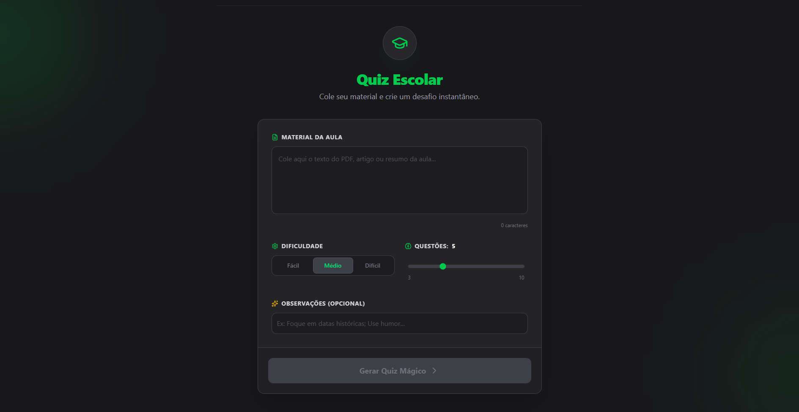

<<<<<<< HEAD
# Quiz Escolar

MVP desenvolvido para facilitar a vida de professores e engajar alunos. A ideia é simples: o professor cola o material da aula (texto), e a IA gera automaticamente um quiz gamificado estilo Duolingo.

## 🛠️ Tecnologias

- **Core:** React + Vite (TypeScript)
- **Estilização:** Tailwind CSS
- **API Inteligência Artificial:** 
=======
Quiz Escolar

MVP desenvolvido para facilitar a vida de professores e engajar alunos. A ideia é simples: o professor cola o material da aula (texto), e a IA gera automaticamente um quiz gamificado estilo Duolingo.

React + Vite

TypeScript

Tailwind CSS

Google Gemini API 

>>>>>>> 66ae7bd63c9e859611d42ae0a2f777e334f2f072
